## My Multi-Robot Simulation Environment
* ME740 Intelligent Mechanics Course Project 

This environment will implment three kinds of multi-robot control strategies on two kinds of dynamics.
Control strategy: virtual structure, behavior-based control, leader-follower control. 
Dynamics: differential drive dynamics, omni-directional dynamics. 

TODO:

1.add formation to behavior=-based control; 
2.try reinforcement learning on bahavior-based model;

### Introduction

There are wo theoretical views on the control of multiple robot systems: centralized systems and decentralized systems. 

In a centralized system, a central unit is responsible for making decision for indivisuals and monitoring the accomplishment of the missoin. Communication only happen between central unit and indibisual, not between individuals. 

In a decentralized system, indivisuals can communicate with each other and share information. Each indiviual is responsible for a portion of the global mission. 

Virtual structure[2] is an exmample of control strategy for a centralized system, where a central unit is controling the motion of all robots in the system. 

Behavior-based strategy[3] is used for decentralized system. Each robot have an inner finite state machine. The states in the fsm correspond to different motor schemas. During running time, the robot switching among different motor schemas(through switching among states) to accomplish its individual goal. 

Leader-follower strategy[4][5] is a hybrid of centralized and decentralized systems. The leader is controlled by central unit, while the followers operate on there own using sensor data. 

### Information
prerequisite:
1. All code wrote and tested with Matlab 2018a
2. Please install the Mobile Robotics Simulation Toolbox from Matlab before running any simulation.

* MATLAB Libraries already included(huge thanks to authors)
1. error_ellipse(draw ellipse given mean and covariance)
2. icp(point set mathcing algorithm)
3. munkres(hungarian algorithm)
   
how to run the demos

* scripts for running the demo simulations can be found in root folder of this repository. Here is a list of all the demos and their corresponding scripts:
1. Behavior based control: runBehaviorBased.m
2. Behavior based control for mapping the environment: runBehaiviorBasedMapping.m
3. Behavior based swarm mapping in a noisy environment with Kalman filter: runBehaviorBasedNoisyMapping.m
4. Leader-follower control: runLeaderFollower.m
5. Leader-follower control with noisy and Kalman filter: runLeaderFollowerNoisy.m
6. Virtual structure control: runVirtualStructure.m
7. Extended Kalman filter localization: runEKFLocalization.m
8. Extended Kalman filter SLAM: runEKFSLAM.m

* To run these scripts, open and run with MATLAB. Don't forget to include the repository in MATLAB search path. 

Reference:
1. Mobile Robotics Simulation Toolbox: https://www.mathworks.com/matlabcentral/fileexchange/66586-mobile-robotics-simulation-toolbox
2. M. Anthony Lewis, Kar-Han Tan. High Precision Formation Control of Mobile Robots Using Virtual Structures. Autonomous Robots, 1997.
3. Tucker Balch, Ronald C. Arkin. Behavior-Based Formation Control for Multirobot Teams. IEEE Transactions on Robotics and Automation, 1998.
4. Luca Cosolini, Fabio Morbidi, Domenico Prattichizzo, Mario Tosques. Leader-follower formation control of nonholonomic mobile robots with input constraints.
5. Jaydev P. Desai, James P. Ostrowski, Vijay Kumar. Modeling and Control of Formations of Nonholonomic Mobile Robot. IEEE Transactions on Robotics and Automation, 2001.
   
### DEMOs

1.virtial-structure control with 3 differential drive robots

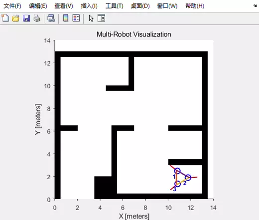

2.virtial-structure control with 6 omni-directional drive robots

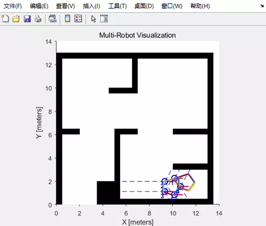

3.behavior-based control with 3 differential drive robots(state machine)

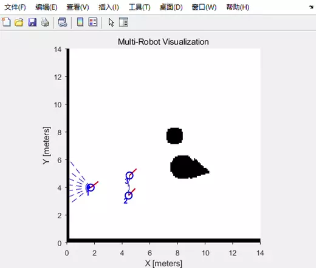

4.behavior-based control with 5 differential drive robots(motor schemas blend)

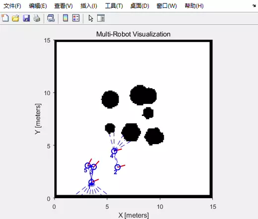

5.leader-follower control in V-shape with 3 differential drive robots

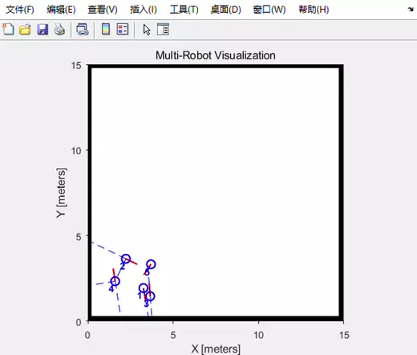

6.leader-follower control in Diamond-shape with 3 differential drive robots

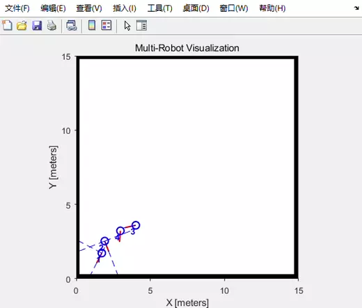

7.behavior-based mapping with three differential robots

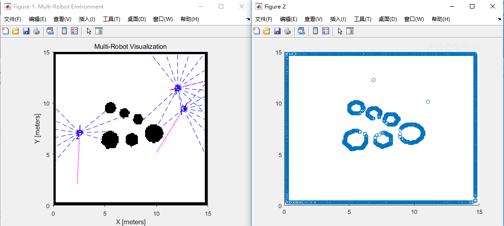

8.behavior-based mapping with Gaussian noise added to odometry and robot detectors.

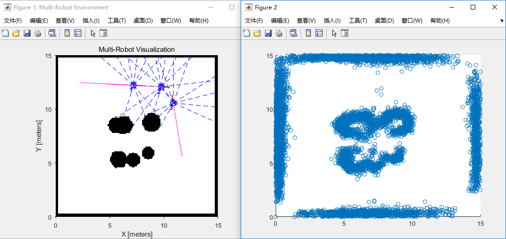

9.behavior-based mapping with Gaussain noise added on odometry. Vanilla Kalman filter is implemented to estimate the real pose from noisy odometry data.

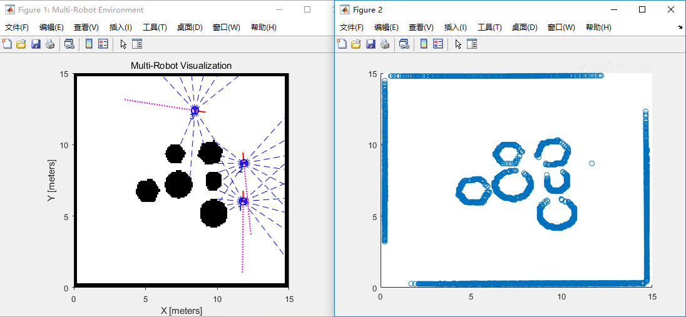

10.localization using extended Kalman filter with correspondences of landmarks

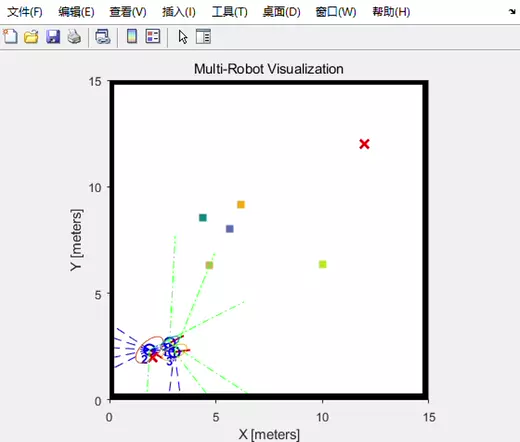

11.left: Leader-follower formation with additive Gaussian noise. right: Leader-follower with additive Gaussian noise,estimating individual pose using Kalman filter.

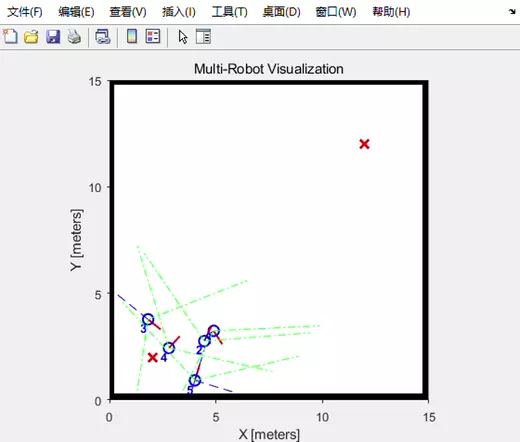
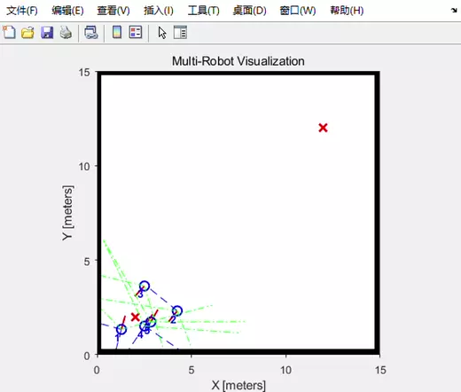

12EKF SLAM: simutaniously localization and mapping based on extended Kalman filter. 

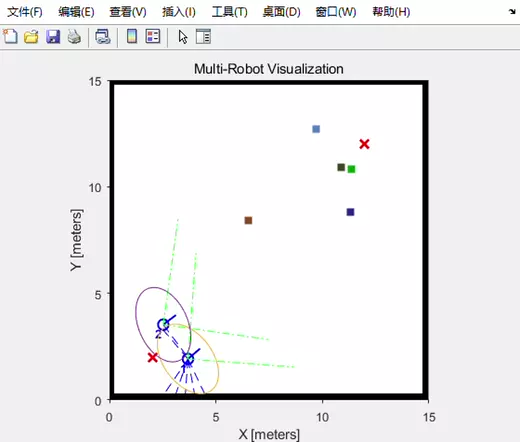